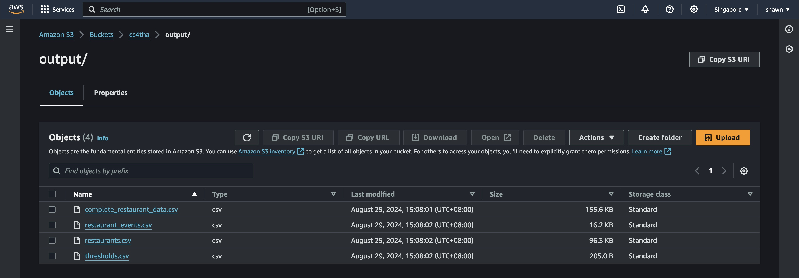

# Travel Food Series Data Analysis

## Case Scenario
**Steven**, a travel blogger, intends to create a travel food series. He is analyzing data from Zomato for inspiration and aims to find restaurants with good user ratings and interesting past events.

### Assumptions and Interpretations
1. **Event Filtering**: Event Start Dates are used to filter for events that took place in April 2019, regardless of the Event End Date. For example, an event that starts on 14 April 2019 and ends on 18 May 2019 is still considered an event that took place in April 2019.
2. **Photo URL Retrieval**: The Photo URL data required for `restaurants_events.csv` is retrieved from:
   - Each Restaurant -> Each Event -> Photo -> Photo URL.

### Design Considerations
- **Unified Preprocessing Function**: 
  - Since the desired output CSV files for the first and second requirements require iterating through the JSON file to extract the necessary values, a single main preprocessing function is used to handle data processing for both requirements.
  - This approach avoids redundancy but necessitates deduplication of rows for unique restaurant details in the first requirement (`restaurants.csv`). For example, a restaurant with 5 events would initially have five rows with duplicated restaurant details (e.g., `res_id`, `name`) but different event details.
  - I have developed two different adaptations for the source code, one which can be run using the notebook (`main.ipynb`), and the other which was run in my AWS Glue job (`main_glue.py`)

- **Data Handling**:
  - A **Pandas DataFrame** is used for data storage and processing instead of a Spark DataFrame, considering the data size is relatively small (< 2000 records).
 
## Architecture and Cloud Deployment Considerations

To deploy this solution, I have utilised `AWS Glue` or `Lambda` jobs to run the source code or script. Making use of `AWS S3`, the job will read source files from a specific bucket and write output files to a desired folder. In order to get this working, there is a need to create an IAM Role in AWS that has both read and write access to S3, as well as Glue Service Access.

S3 will be configured with a bucket that contains two folders, `Source` and `Output`, where the Source folder will contain the source data files, and the Output folder will contain the output files such as restaurant.csv and restaurant_events.csv.

  


There is also a function in the script to export a json file to the Source folder from a JSON URL link.

With this setup, whenever there is a change in the restaurant data or country codes, we can replace the source files in the dedicated S3 bucket, and manually run the glue job again to overwrite the output files in Output folder. 

One consideration of deploying this solution on AWS is the seamless process of generating the requirements.
By utilising `S3 Event Notifications` and `AWS Lambda` to detect any changes in the Source Data Files and automatically invoke the start of the glue job, making the generation of these output files a much more seamless process.
Alternatively, in the case where source data is uploaded or amended on regular intervals, we can consider the use of Amazon EventBridge to schedule the invocation of the glue job periodically.

## Architecture Diagram

The diagram shows two possible paths we can trigger the glue job. The first approach uses `S3 Event Notifications` and `AWS Lambda`, whille the second approach relies on a scheduler with the help of `AWS EventBridge`. Furthermore, if source files were to be moved to a database, we can utitilise `RDS` and extract data from there, instead of the Excel and JSON files.

## Documents Overview
`AWS_Architecture_Diagram.jpg` - Photo of AWS Architecture Diagram
`complete_restaurant_data.csv` - All restaurant and event details, restaurant details may be duplicated depending on number of events held
`Country-Code.xlsx` - Source file containg Country Codes and corresponding countries
`main_glue.py` - Main python script used in AWS Glue job
`restaurant_data.json` - JSON file retrieved from JSON URL link
`restaurant_events.csv` - List of events and their corresponding restaurant details
`restaurants.csv` - Unique List of restaurants and their details
`S3_Folders.jpg` - Screenshot of AWS S3 directory
`S3_OutputFiles.jpg` - Screenshot of AWS S3 Output Folder
`thresholds.csv` - List of Rating texts and their correspondig min, max and average values

## Instructions on How to Run the Source Code

### 1. Install Jupyter Notebook or JupyterLab
If you don't have Jupyter installed, you can install it using Anaconda or pip.

**Using Anaconda:**
```bash
conda install -c conda-forge notebook
```

### 2. Install required Python Packages

**Using Pip:**
```bash
pip install pandas json requests openpyxl
```

### 3. Run the Notebook

Open the Notebook and click on `Run All`
